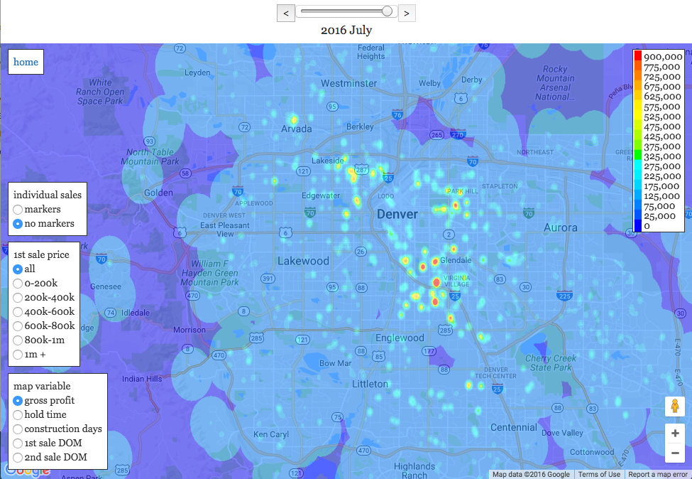

# HotSpots

### Application to view several real estate metrics overlayed on a map of the area.

## Overview:
This is one way to visually render flip metrics on a map.  Flips are made up of two different events, a 1st sale and a 2nd sale (with construction/modifications between).  The possible metrics used here are gross profit, hold time, construction days, 1st sale DOM (days on market), 2nd sale DOM (days on market).  The data can also be subset by the sale price of the 1st sale.  Both of these attributes can be selected on the lower left side of the map.  The time period is selected by the slider at the top.  The metrics are aggregated for the past 6 months from the date given.

## Data:
The data comes from a few MLSs in partnership and agreement with Privy

## Code:
The code breaks down into three main parts:
- creating csv files from the MLS SQL datbases
    - code/init_data.py
- creating the img files for the app
    - MLS.py: organizes and calculates csv files for each metric, then calls gausify.cpp to do the gaussian convolution over space (I found that c++ is faster for the numerics)
    - gausify.cpp: does the numerics and writes the png image file
- running the app
    - code/HS_app :HS_app.py is the flask app that calls the map.html template.  map.html is responsible for overlaying the .png file with the data over the google map.

## To Do:
- comment and streamline the MLS.py and gausify.cpp files
- make an interface to control initial filepaths and the variables that can be set
- streamline the app files
- think about ways to render the data dynamically (however too many choices about the data may just serve to overwhelm any potential users).  This may constitute changing the layout of the entire code and using a different layout for the app, I'm not sure if this would make it too slow or not.

## References:
- general map overlay: https://github.com/jeffkaufman/apartment_prices
- time slider from: https://gist.github.com/kosso/1118840
